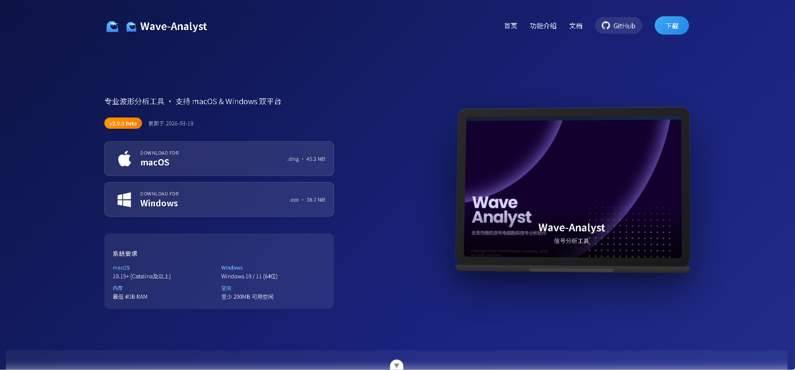
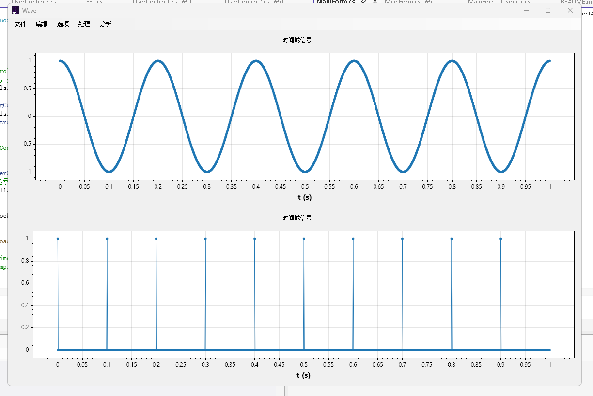
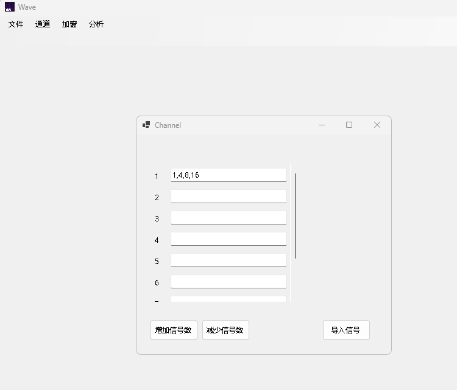

# Wave Analyst (version 0.0.1)

Copyright(C) 2025, Central South University.
All rights reserved.

## Introduction

Wave Analyst is a software tool designed for performing signal analysis in Wide Field Electromagnetic Method(WFEM). It provides functionalities to calculate, analyze, and visualize broad-spectrum-combined-wave almost any sequence of pseudo-random-signal.

## image

 
 
  
 

## Updata Log
1. Download Pgae
2. 特殊格式的信号文件 *.wa
3. 通道

### December 12, 2025

* Initial release of Wave Analyst (version 0.0.1)
* Added basic functionality about mathematical operations
* Included documentation and usage instructions in README.md
* Set up project structure and version control
