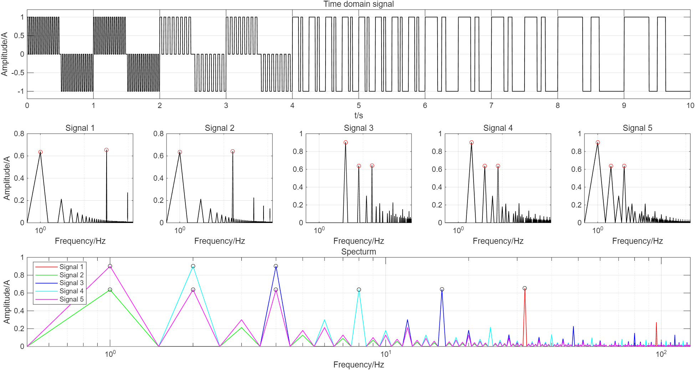

# Wave Analyst (version 0.0.1)

Copyright(C) 2025, Central South University. 
All rights reserved.

## Introduction

Wave Analyst is a software tool designed for performing signal analysis in Wide Field Electromagnetic Method(WFEM). It provides functionalities to calculate, analyze, and visualize broad-spectrum-combined-wave almost any sequence of pseudo-random-signal.

Now Wave Analyst is available for Windows. You can download it from the [release page](https://github.com/PourRevenir/Wave-Analyst). Usage instructions are provided in the [README.md](Source\method\output\build\readme.txt).

## Updata Log

### January 3, 2026
- Algorithmic is updated
- Application for Windows is compiled 

### December 12, 2025

- Initial release of Wave Analyst (version 0.0.1)
- Added basic functionality about mathematical operations
- Included documentation and usage instructions in README.md
- Set up project structure and version control